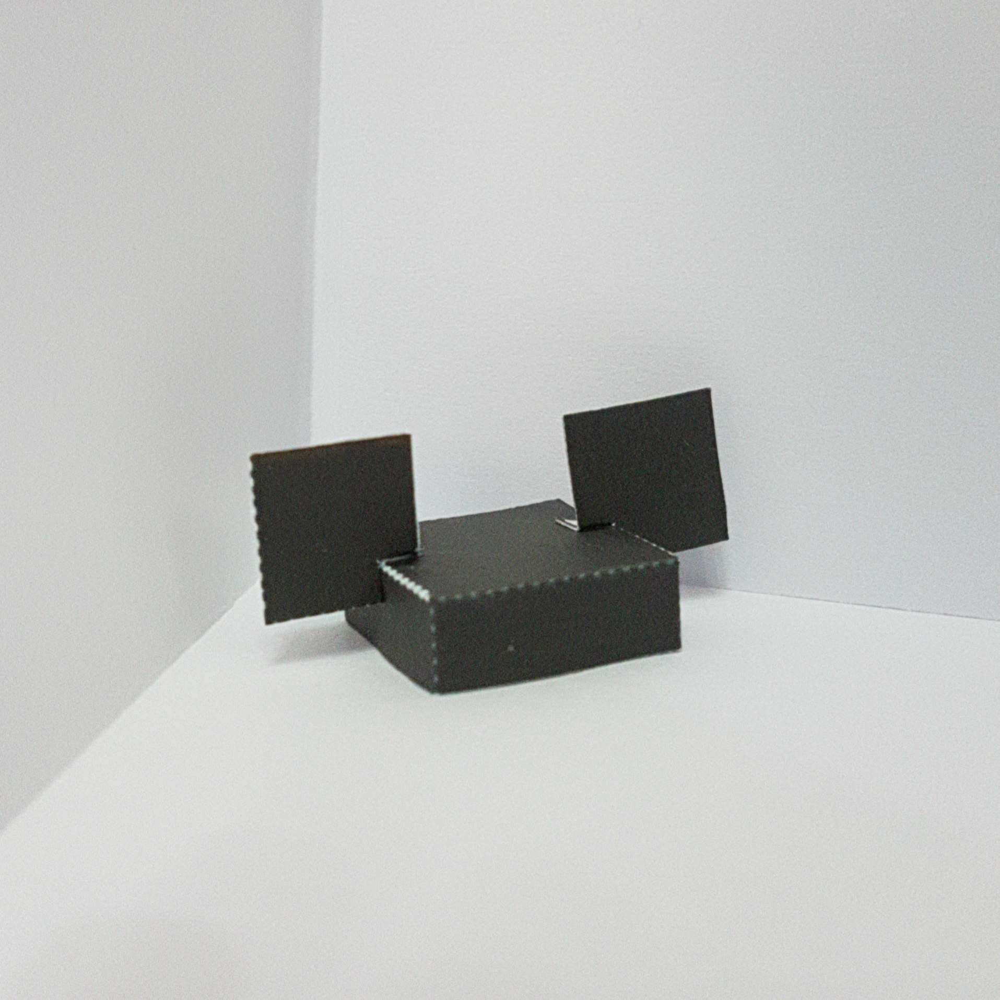

# MINECRAFT MICKEY EARS PAPERCRAFT GENERATOR #

Created by # MINECRAFT MICKEY EARS PAPERCRAFT GENERATOR #

Created by [ArgentiCityzen14](http://pixelpapercraft.com/user/argenticityzen14) | View project on [GitHub](https://github.com/TepigMC/Papercraft-Pig-Generator)

## Features ##

This generator creates a mickey ears papercraft like the accesories of Disneyland and Walt Disney World. It includes:

  - Minnie bow for make your Minnie ears
  - Instructions
  - A transparent background

## Textures ##

The generator provides textures of 64x64 and also 128x128.

  - Original textures from Minecraft Vanilla
  - Original black Mickey ears,
  - Mickey Pants style ears,
  - R2-D2 ears,
  - Minnie ears,
  - EPCOT Ball (Spaceship Earth) ears,
  - Donald Duck ears,
  - 50th Anniversary ears

## Printing ##

You can print the ears in "Fit to frame" or sizing it using your papercraft head.

## Credits ##

  - [ArgentiCityzen14](http://pixelpapercraft.com/user/argenticityzen14) for the idea, generator and templates.# MINECRAFT MICKEY EARS PAPERCRAFT GENERATOR #

Created by [ArgentiCityzen14](http://pixelpapercraft.com/user/argenticityzen14) | View project on [GitHub](https://github.com/TepigMC/Papercraft-Pig-Generator)

## Features ##

This generator creates a mickey ears papercraft like the accesories of Disneyland and Walt Disney World. It includes:

  - Minnie bow for make your Minnie ears
  - Instructions
  - A transparent background

## Textures ##

The generator provides textures of 64x64 and also 128x128.

  - Original textures from Minecraft Vanilla
  - Original black Mickey ears,
  - Mickey Pants style ears,
  - R2-D2 ears,
  - Minnie ears,
  - EPCOT Ball (Spaceship Earth) ears,
  - Donald Duck ears,
  - 50th Anniversary ears

## Printing ##

You can print the ears in "Fit to frame" or sizing it using your papercraft head.

## Credits ##

  - [ArgentiCityzen14](http://pixelpapercraft.com/user/argenticityzen14) for the idea, generator and templates. | View project on [GitHub](https://github.com/TepigMC/Papercraft-Pig-Generator)

## Features ##

This generator creates a mickey ears papercraft like the accesories of Disneyland and Walt Disney World. It includes:

  - Minnie bow for make your Minnie ears
  - Instructions
  - A transparent background

## Textures ##

The generator provides textures of 64x64 and also 128x128.

  - Original textures from Minecraft Vanilla
  - Original black Mickey ears,
  - Mickey Pants style ears,
  - R2-D2 ears,
  - Minnie ears,
  - EPCOT Ball (Spaceship Earth) ears,
  - Donald Duck ears,
  - 50th Anniversary ears

## Printing ##

You can print the ears in "Fit to frame" or sizing it using your papercraft head.

## Generator URL ##

[Mickey Ears Generator](https://argenticityzenx.github.io/pixel-papercraft-generator-builder/#minecraft-mickey-ears) for the idea, generator and templates.

## Credits ##

  - [ArgentiCityzen14](http://pixelpapercraft.com/user/argenticityzen14) for the idea, generator and templates.
